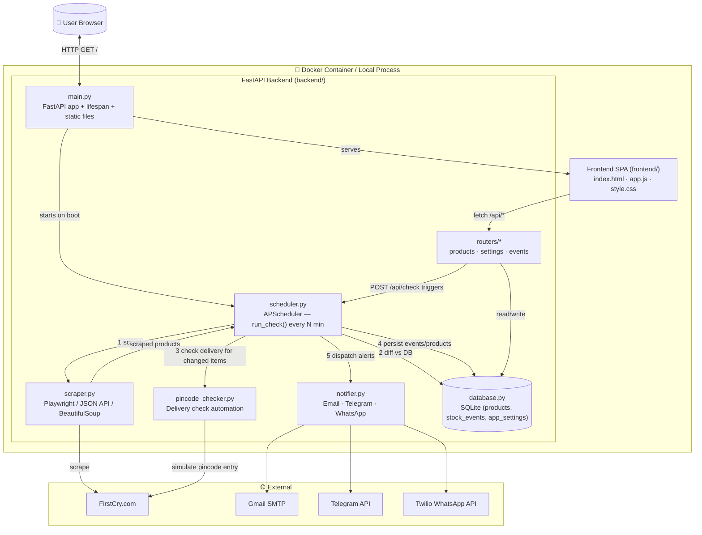
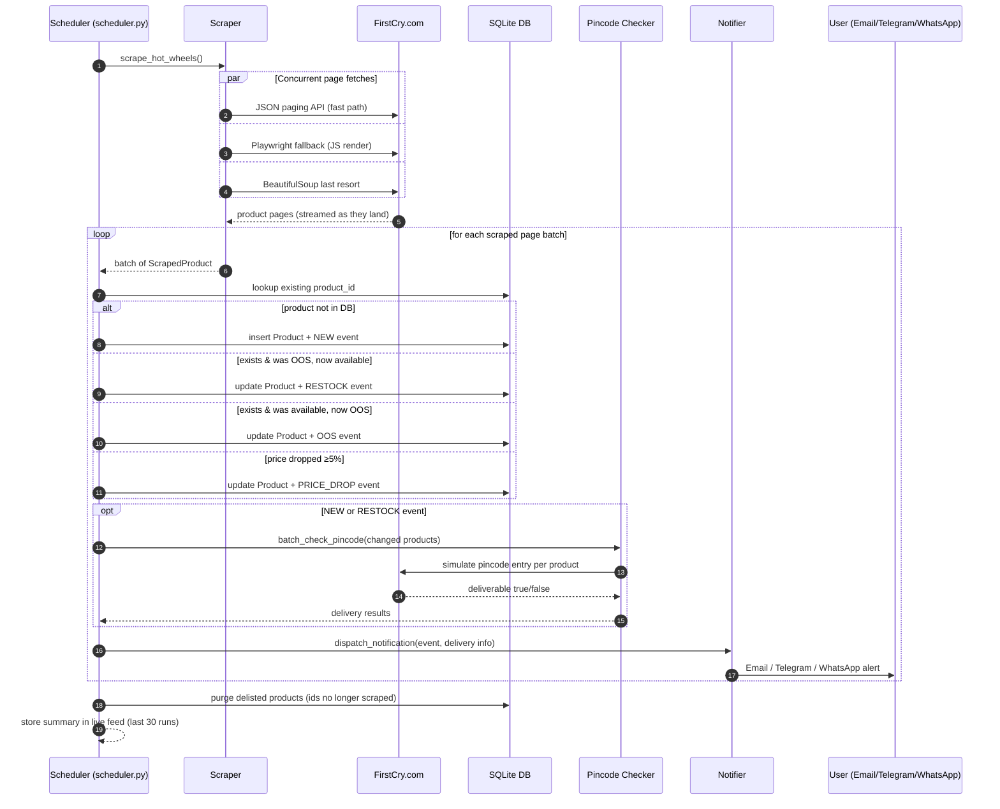
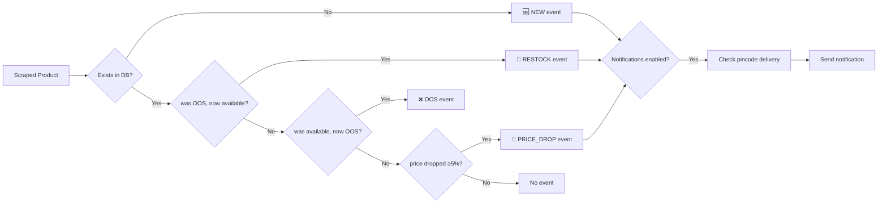

# 🚗 Hot Wheels Hunt

Monitors **FirstCry.com** for Hot Wheels car availability, tracks stock changes
over time, checks delivery to your pincode, and sends alerts via **Email**,
**Telegram**, or **WhatsApp**.

---

## Features

| Feature       | Detail                                                  |
| ------------- | ------------------------------------------------------- |
| Scraping      | Playwright headless browser (handles JS-rendered pages) |
| Detection     | New products, Restocks, Out-of-stock, Price drops (≥5%) |
| Pincode check | Browser-automated delivery check per changed product    |
| Scheduler     | APScheduler — runs every N minutes (default: 10)        |
| Notifications | Email (SMTP), Telegram Bot, WhatsApp (Twilio)           |
| Dashboard     | Vanilla-JS SPA — product grid, stats bar, event log     |
| Database      | SQLite via SQLAlchemy                                   |
| Deployment    | Local (uvicorn) or Docker                               |

---

## Architecture



### Check Pipeline Workflow



### Event Detection Rules



---

## Quick Start (Local)

### 1. Prerequisites

- Python 3.11+
- pip

### 2. Install dependencies

```bash
pip install -r requirements.txt
playwright install chromium
```

### 3. Configure environment

```bash
cp .env.example .env
# Edit .env with your values (pincode, notification keys, etc.)
```

### 4. Run

```bash
uvicorn backend.main:app --reload
```

Open [http://localhost:8000](http://localhost:8000) in your browser.

---

## Docker

```bash
# Build & start
docker compose up -d --build

# View logs
docker compose logs -f

# Stop
docker compose down
```

The SQLite database is persisted in `./hotwheels.db` on the host.

---

## Environment Variables

| Variable                 | Default          | Description                                   |
| ------------------------ | ---------------- | --------------------------------------------- |
| `DEFAULT_PINCODE`        | `400001`         | Your 6-digit delivery pincode                 |
| `CHECK_INTERVAL_MINUTES` | `10`             | Scrape frequency                              |
| `MAX_PAGES`              | `5`              | Max search result pages per run (0 = all)     |
| `FIRSTCRY_SEARCH_URL`    | FirstCry search  | URL to scrape (can change to a category page) |
| `EMAIL_ENABLED`          | `false`          | Enable email alerts                           |
| `SMTP_HOST`              | `smtp.gmail.com` | SMTP server                                   |
| `SMTP_PORT`              | `587`            | SMTP port                                     |
| `SMTP_USER`              | —                | Gmail address                                 |
| `SMTP_PASSWORD`          | —                | Gmail App Password                            |
| `EMAIL_TO`               | —                | Recipient address                             |
| `TELEGRAM_ENABLED`       | `false`          | Enable Telegram alerts                        |
| `TELEGRAM_BOT_TOKEN`     | —                | `@BotFather` token                            |
| `TELEGRAM_CHAT_ID`       | —                | Your Telegram user/chat ID                    |
| `WHATSAPP_ENABLED`       | `false`          | Enable WhatsApp via Twilio                    |
| `TWILIO_ACCOUNT_SID`     | —                | Twilio Account SID                            |
| `TWILIO_AUTH_TOKEN`      | —                | Twilio Auth Token                             |
| `WHATSAPP_TO`            | —                | `whatsapp:+91XXXXXXXXXX`                      |

---

## Notification Setup

### Email (Gmail)

1. Enable **2-Step Verification** on your Google account.
2. Go to **Google Account → Security → App Passwords**.
3. Generate an App Password for "Mail".
4. Set `SMTP_USER`, `SMTP_PASSWORD`, `EMAIL_TO` in `.env`.
5. Set `EMAIL_ENABLED=true`.

### Telegram Bot

1. Open Telegram and search for **@BotFather**.
2. Send `/newbot` and follow prompts → copy the **token**.
3. Start a chat with your bot, then visit:
   `https://api.telegram.org/bot<TOKEN>/getUpdates`
   to get your **chat_id**.
4. Set `TELEGRAM_BOT_TOKEN`, `TELEGRAM_CHAT_ID` in `.env`.
5. Set `TELEGRAM_ENABLED=true`.

### WhatsApp (Twilio)

1. Create a [Twilio](https://twilio.com) account.
2. Enable **WhatsApp Sandbox** in the Twilio Console.
3. Set `TWILIO_ACCOUNT_SID`, `TWILIO_AUTH_TOKEN`, `WHATSAPP_TO`.
4. Set `WHATSAPP_ENABLED=true`.

---

## API Reference

| Method | Endpoint                     | Description                 |
| ------ | ---------------------------- | --------------------------- |
| `GET`  | `/api/products`              | List all tracked products   |
| `GET`  | `/api/products/{id}/history` | Stock history for a product |
| `GET`  | `/api/products/series/list`  | Available series names      |
| `POST` | `/api/check`                 | Trigger an immediate check  |
| `GET`  | `/api/stats`                 | Dashboard summary stats     |
| `GET`  | `/api/settings`              | Current settings            |
| `PUT`  | `/api/settings`              | Update settings             |
| `GET`  | `/api/events`                | Recent stock events         |

Interactive API docs: [http://localhost:8000/docs](http://localhost:8000/docs)

---

## Example Notification

```
🔄 Hot Wheels Alert — Back In Stock!

Product : Hot Wheels Car Culture Premium Assorted
Price   : ₹599 (MRP ₹799 — 25% off)
Stock   : In Stock ✅
Delivery: ✅ Deliverable to 400001
Series  : Car Culture
Link    : https://www.firstcry.com/...

Checked at 2025-01-15 10:30 UTC
```

---

## Project Structure

```
hotwheels-hunt/
├── backend/
│   ├── main.py            # FastAPI app + lifespan
│   ├── config.py          # Pydantic settings from .env
│   ├── database.py        # SQLAlchemy models & DB init
│   ├── models.py          # Pydantic schemas
│   ├── scraper.py         # Playwright scraper
│   ├── pincode_checker.py # Delivery check automation
│   ├── notifier.py        # Email / Telegram / WhatsApp
│   ├── scheduler.py       # APScheduler pipeline
│   └── routers/
│       ├── products.py
│       ├── settings.py
│       └── events.py
├── frontend/
│   ├── index.html         # Dashboard SPA
│   ├── style.css
│   └── app.js
├── .env.example
├── requirements.txt
├── Dockerfile
└── docker-compose.yml
```

---

## Notes & Limitations

- **Anti-scraping**: The scraper uses stealth headers and random delays.
  If FirstCry changes their HTML structure, update selectors in `scraper.py`.
- **Pincode check**: Performed only for _changed_ products (new/restock/price-drop)
  to minimise browser sessions. Results are cached in-memory for the session.
- **Rate limiting**: Default interval is 10 min; avoid setting it below 5 min.
- **Playwright + Docker**: The Dockerfile installs Chromium system deps automatically.
